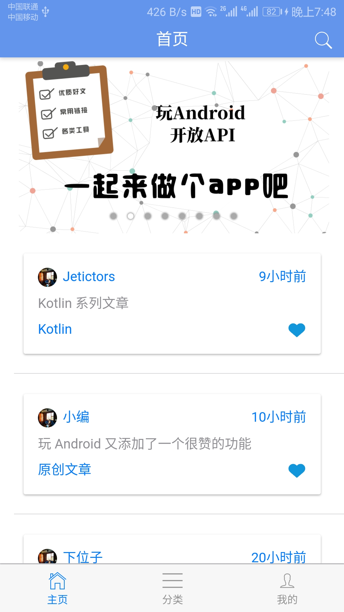
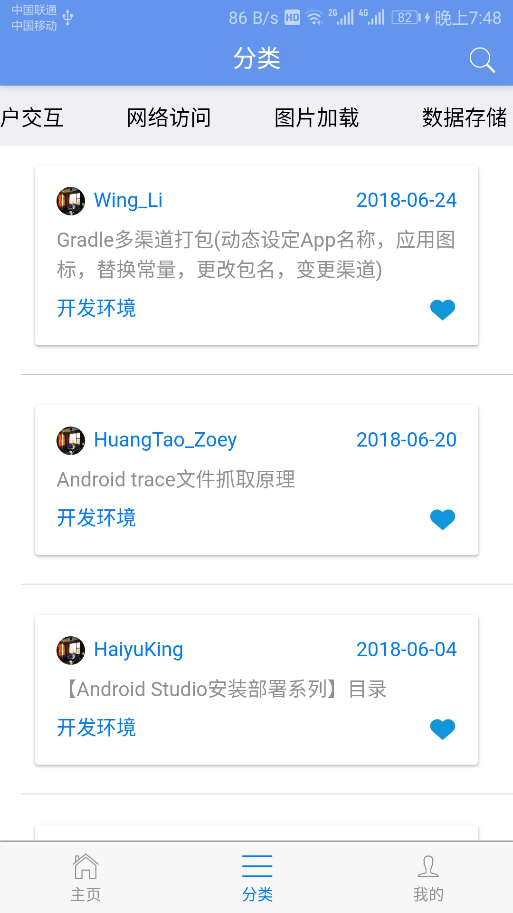
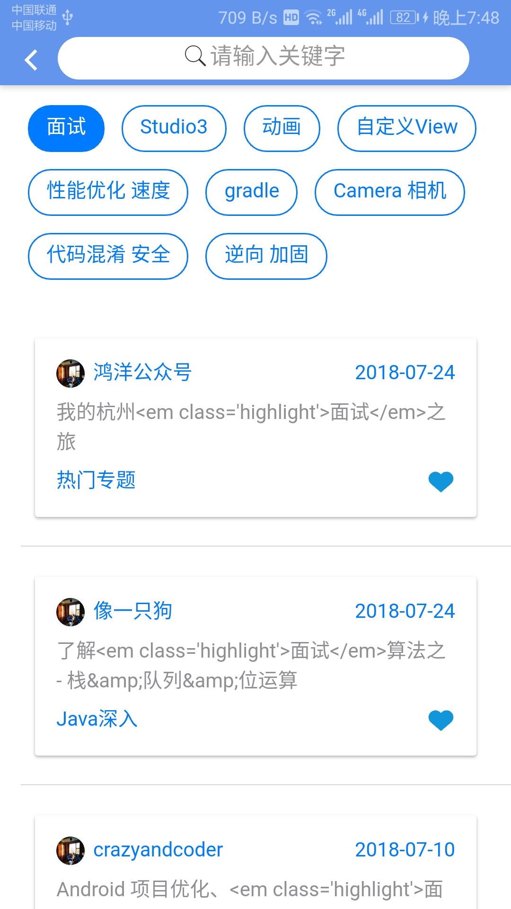
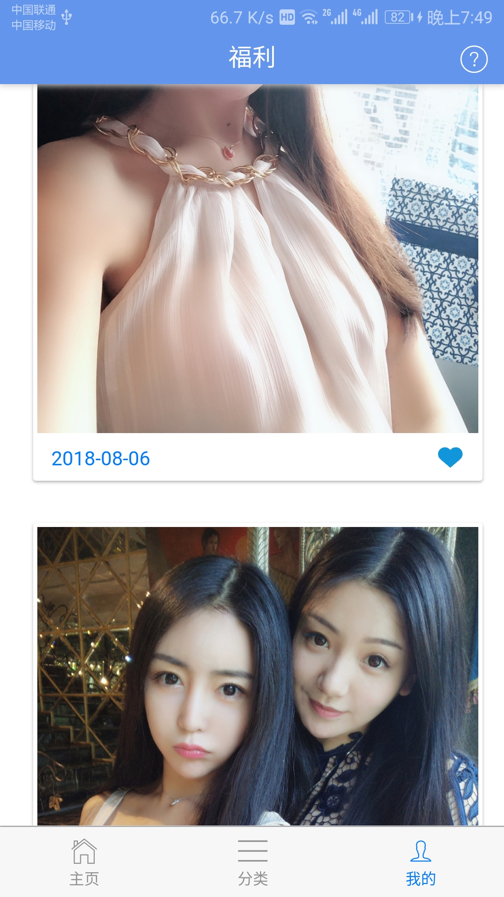
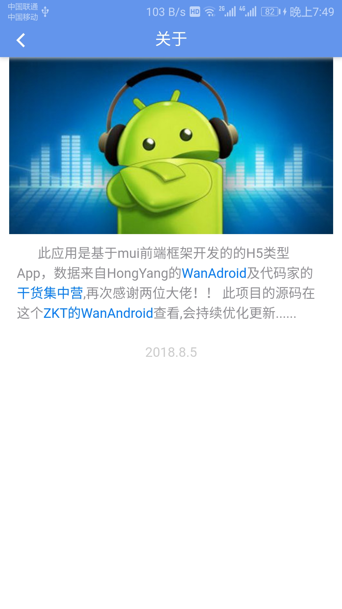

# WanAndroid

这是一个基于Mui和Vue.js开发的App，使用的开发工具是HBuilder,此项目是我学习H5的一个实践项目，后续会持续优化更新...

## 预览
   
   
 

## [下载Demo](https://fir.im/wanandroi)

## Api来自WanAndroid和干货集中营

* http://www.wanandroid.com/blog/show/2
* https://gank.io/api

